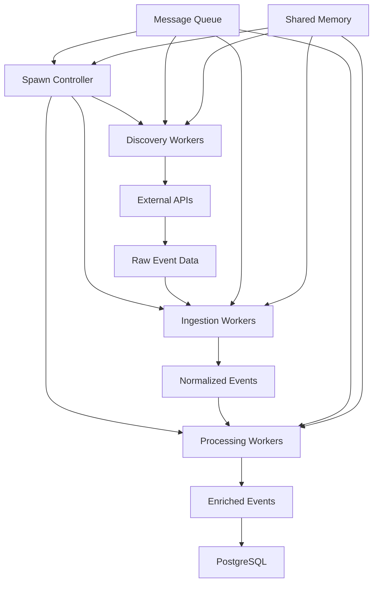

# Spawning Solution Architecture

## Overview
This document defines the technical architecture for a robust event spawning system within the SceneScout application. The architecture supports concurrent event discovery, ingestion, and processing across multiple data sources.

## Core Components

### 1. Spawn Controller
**Purpose**: Central orchestration component that manages the lifecycle of spawned workers
- **Responsibilities**:
  - Worker pool management
  - Task distribution and load balancing
  - Health monitoring and auto-recovery
  - Resource allocation and limits

### 2. Worker Types

#### 2.1 Discovery Workers
- **Purpose**: Scan external APIs for new events
- **Capabilities**:
  - API-specific adapters (Eventbrite, Ticketmaster, Yelp, etc.)
  - Rate limit management
  - Geographic distribution
  - Incremental discovery tracking

#### 2.2 Ingestion Workers
- **Purpose**: Process and normalize discovered events
- **Capabilities**:
  - Data validation and sanitization
  - Deduplication logic
  - Enrichment pipeline
  - Batch processing optimization

#### 2.3 Processing Workers
- **Purpose**: Handle post-ingestion operations
- **Capabilities**:
  - Image optimization
  - Geocoding and location services
  - Category classification
  - Quality scoring

### 3. Communication Layer

#### 3.1 Message Queue
- **Technology**: Redis Pub/Sub or PostgreSQL LISTEN/NOTIFY
- **Channels**:
  - `spawn.discovery.{source}` - Discovery task distribution
  - `spawn.ingestion.{batch}` - Ingestion task queue
  - `spawn.processing.{type}` - Processing pipeline
  - `spawn.control.{command}` - Control plane messages

#### 3.2 Shared Memory
- **Purpose**: High-performance state sharing
- **Components**:
  - Worker registry
  - Task assignments
  - Performance metrics
  - Configuration cache

### 4. Data Flow Architecture



## Implementation Guidelines

### 1. Worker Spawning Strategy

```typescript
interface SpawnConfig {
  workerType: 'discovery' | 'ingestion' | 'processing';
  concurrency: number;
  resourceLimits: {
    memory: string;
    cpu: number;
    timeout: number;
  };
  retryPolicy: {
    maxRetries: number;
    backoffMultiplier: number;
    maxBackoff: number;
  };
}

class SpawnController {
  private workers: Map<string, Worker> = new Map();
  private queue: MessageQueue;
  private sharedMemory: SharedMemoryStore;
  
  async spawnWorker(config: SpawnConfig): Promise<Worker> {
    // Worker spawning logic with resource allocation
  }
  
  async distributeTask(task: Task): Promise<void> {
    // Task distribution with load balancing
  }
  
  async monitorHealth(): Promise<void> {
    // Health monitoring and auto-recovery
  }
}
```

### 2. Communication Protocol

```typescript
interface SpawnMessage {
  id: string;
  type: 'task' | 'control' | 'status' | 'result';
  source: string;
  target?: string;
  payload: any;
  timestamp: number;
  priority: number;
}

interface TaskAssignment {
  taskId: string;
  workerId: string;
  taskType: string;
  parameters: any;
  deadline: number;
  retryCount: number;
}
```

### 3. State Management

```typescript
interface WorkerState {
  id: string;
  type: string;
  status: 'idle' | 'busy' | 'error' | 'shutdown';
  currentTask?: string;
  performance: {
    tasksCompleted: number;
    averageTime: number;
    errorRate: number;
    lastHeartbeat: number;
  };
}

interface SpawnSystemState {
  workers: Map<string, WorkerState>;
  taskQueue: PriorityQueue<Task>;
  activeAssignments: Map<string, TaskAssignment>;
  metrics: SystemMetrics;
}
```

## Architectural Decisions

### 1. Concurrency Model
- **Decision**: Use Worker Threads for CPU-intensive tasks
- **Rationale**: Provides true parallelism for data processing
- **Alternative**: Child processes for complete isolation

### 2. Communication Pattern
- **Decision**: Event-driven architecture with message passing
- **Rationale**: Loose coupling, scalability, fault tolerance
- **Alternative**: Shared memory with locks

### 3. Resource Management
- **Decision**: Dynamic worker pool with auto-scaling
- **Rationale**: Efficient resource utilization, cost optimization
- **Alternative**: Fixed worker pool

### 4. Failure Handling
- **Decision**: Circuit breaker pattern with exponential backoff
- **Rationale**: Prevents cascade failures, graceful degradation
- **Alternative**: Simple retry with fixed delay

## Performance Considerations

### 1. Bottleneck Prevention
- Worker pool sizing based on CPU cores
- Connection pooling for database and APIs
- Batch processing for bulk operations
- Caching frequently accessed data

### 2. Monitoring Metrics
- Worker utilization rates
- Task completion times
- Queue depths
- Error rates and types
- API rate limit usage

### 3. Optimization Strategies
- Geographic distribution of discovery workers
- Time-based scheduling for off-peak processing
- Adaptive concurrency based on system load
- Incremental processing with checkpoints

## Security Considerations

### 1. Worker Isolation
- Sandboxed execution environment
- Limited filesystem access
- Network access control lists

### 2. API Key Management
- Encrypted storage
- Rotation policies
- Per-worker key allocation

### 3. Data Protection
- Input validation
- Output sanitization
- Audit logging

## Deployment Architecture

### 1. Development Environment
- Single-node deployment
- Mock external APIs
- Reduced worker counts

### 2. Production Environment
- Multi-node deployment
- Load balancer for API endpoints
- Redis cluster for message queue
- PostgreSQL with read replicas

### 3. Scaling Strategy
- Horizontal scaling of worker nodes
- Vertical scaling of controller node
- Auto-scaling based on queue depth

## Integration Points

### 1. External APIs
- Eventbrite API v3
- Ticketmaster Discovery API
- Yelp Fusion API
- Google Places API
- Meetup API

### 2. Internal Systems
- PostgreSQL database
- Supabase Edge Functions
- Image processing service
- Geocoding service
- Analytics pipeline

## Future Enhancements

### 1. Machine Learning Integration
- Event quality prediction
- Duplicate detection improvement
- Category auto-classification

### 2. Real-time Processing
- WebSocket support for live updates
- Stream processing for high-volume sources

### 3. Advanced Scheduling
- Predictive resource allocation
- Cost-optimized scheduling
- Priority-based processing

## Conclusion

This architecture provides a robust, scalable foundation for the SceneScout event spawning system. The design emphasizes fault tolerance, performance optimization, and maintainability while supporting the complex requirements of multi-source event discovery and processing.