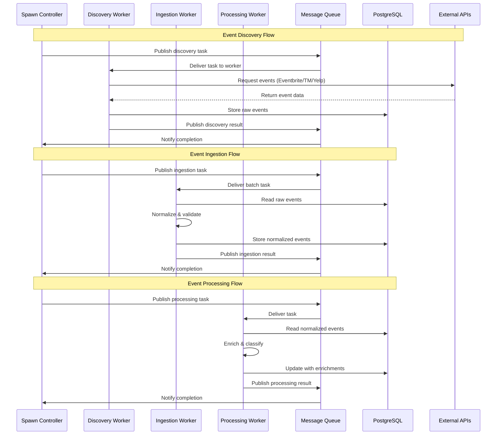
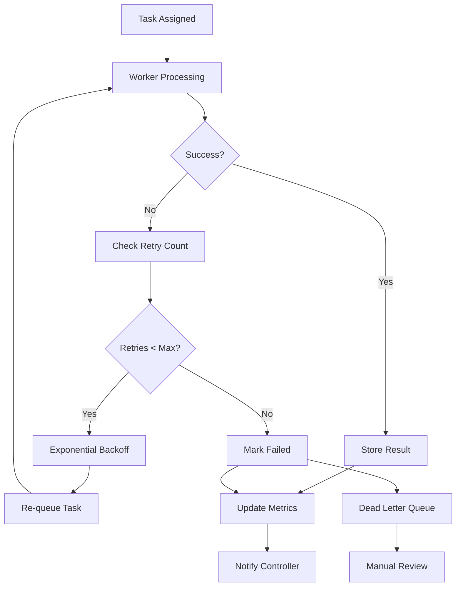
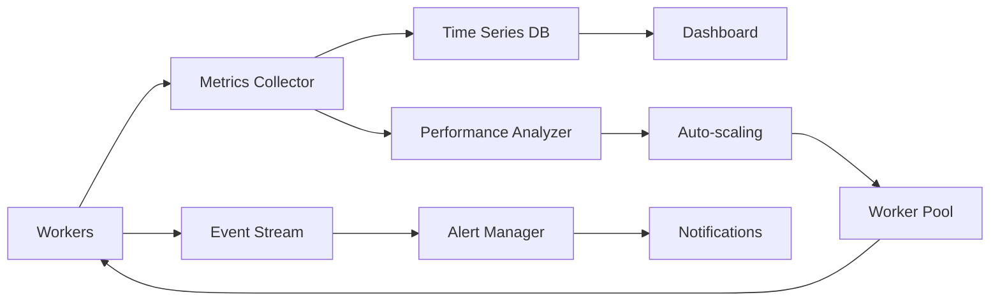

# Spawn System Data Flow Architecture

## Overview
This document details the data flow patterns and interactions between components in the SceneScout spawning system.

## 1. Primary Data Flow



## 2. Component Interactions

### 2.1 Spawn Controller ↔ Workers

```typescript
// Controller → Worker Messages
interface TaskMessage {
  type: 'task';
  assignment: {
    taskId: string;
    taskType: 'discovery' | 'ingestion' | 'processing';
    parameters: any;
    deadline: number;
  };
}

interface ControlMessage {
  type: 'health' | 'shutdown' | 'pause' | 'resume';
  workerId: string;
}

// Worker → Controller Messages
interface ResultMessage {
  type: 'result';
  taskId: string;
  workerId: string;
  result: any;
  metrics: {
    duration: number;
    itemsProcessed: number;
    errorCount: number;
  };
}

interface StatusMessage {
  type: 'status';
  workerId: string;
  status: 'idle' | 'busy' | 'error';
  currentTask?: string;
  performance: WorkerPerformance;
}
```

### 2.2 Message Queue Channels

```typescript
// Channel naming convention: spawn.{operation}.{target}
interface MessageChannels {
  // Task distribution
  'spawn.task.discovery': DiscoveryTask;
  'spawn.task.ingestion': IngestionTask;
  'spawn.task.processing': ProcessingTask;
  
  // Results and status
  'spawn.result.discovery': DiscoveryResult;
  'spawn.result.ingestion': IngestionResult;
  'spawn.result.processing': ProcessingResult;
  
  // Control plane
  'spawn.control.worker': WorkerControl;
  'spawn.control.system': SystemControl;
  
  // Monitoring
  'spawn.metrics.worker': WorkerMetrics;
  'spawn.metrics.system': SystemMetrics;
}
```

## 3. Data Storage Patterns

### 3.1 Raw Event Storage

```sql
-- Temporary storage for discovered events
CREATE TABLE raw_events (
  id UUID PRIMARY KEY DEFAULT gen_random_uuid(),
  source TEXT NOT NULL,           -- API source (eventbrite, ticketmaster, etc.)
  external_id TEXT NOT NULL,      -- Source's event ID
  data JSONB NOT NULL,            -- Raw API response
  discovered_at TIMESTAMPTZ NOT NULL,
  location GEOGRAPHY(POINT),      -- Geographic location
  date_range TSTZRANGE,          -- Event date range
  processed BOOLEAN DEFAULT FALSE,
  processed_at TIMESTAMPTZ,
  ingestion_batch_id UUID,       -- Links to ingestion batch
  error TEXT,
  retry_count INTEGER DEFAULT 0,
  
  UNIQUE(source, external_id)
);

-- Index for efficient querying
CREATE INDEX idx_raw_events_unprocessed ON raw_events (processed, discovered_at)
  WHERE processed = FALSE;
CREATE INDEX idx_raw_events_location ON raw_events USING GIST (location);
CREATE INDEX idx_raw_events_date_range ON raw_events USING GIST (date_range);
```

### 3.2 Processing Pipeline States

```sql
-- Track ingestion batches
CREATE TABLE ingestion_batches (
  id UUID PRIMARY KEY DEFAULT gen_random_uuid(),
  source TEXT NOT NULL,
  worker_id TEXT NOT NULL,
  event_count INTEGER NOT NULL,
  status TEXT NOT NULL,           -- pending, processing, completed, failed
  started_at TIMESTAMPTZ DEFAULT NOW(),
  completed_at TIMESTAMPTZ,
  error TEXT,
  duplicate_count INTEGER DEFAULT 0,
  normalized_count INTEGER DEFAULT 0,
  
  -- Performance metrics
  processing_time_ms INTEGER,
  events_per_second FLOAT
);

-- Track individual event processing
CREATE TABLE event_processing_log (
  event_id UUID REFERENCES events(id),
  stage TEXT NOT NULL,            -- discovery, ingestion, enrichment, etc.
  status TEXT NOT NULL,           -- success, failed, skipped
  worker_id TEXT,
  processing_time_ms INTEGER,
  error TEXT,
  created_at TIMESTAMPTZ DEFAULT NOW()
);
```

## 4. Error Handling Flow



### 4.1 Error Recovery Strategies

```typescript
interface ErrorHandlingConfig {
  maxRetries: number;
  backoffStrategy: 'exponential' | 'linear' | 'fixed';
  baseDelay: number;
  maxDelay: number;
  jitter: boolean;
  
  // Error categorization
  retryableErrors: string[];
  fatalErrors: string[];
  
  // Circuit breaker
  circuitBreaker: {
    enabled: boolean;
    failureThreshold: number;
    timeoutMs: number;
    monitoringPeriodMs: number;
  };
}

class ErrorHandler {
  async handleTaskError(
    task: Task,
    error: Error,
    context: WorkerContext
  ): Promise<ErrorAction> {
    // Categorize error
    const category = this.categorizeError(error);
    
    if (category === 'fatal' || task.retryCount >= this.config.maxRetries) {
      return { action: 'fail', reason: error.message };
    }
    
    if (category === 'rate_limit') {
      return { 
        action: 'retry', 
        delay: this.calculateRateLimitDelay(error),
        priority: 'low' 
      };
    }
    
    // Standard retry with backoff
    const delay = this.calculateBackoffDelay(task.retryCount);
    return { action: 'retry', delay };
  }
}
```

## 5. Performance Optimization Patterns

### 5.1 Batch Processing

```typescript
interface BatchProcessor {
  batchSize: number;
  maxWaitTime: number;
  
  async processBatch<T>(
    items: T[],
    processor: (batch: T[]) => Promise<void>
  ): Promise<void> {
    const batches = this.createBatches(items, this.batchSize);
    
    // Process batches in parallel with concurrency control
    await Promise.allSettled(
      batches.map(batch => processor(batch))
    );
  }
}

// Usage in ingestion worker
class IngestionWorker extends BaseWorker {
  private batchProcessor = new BatchProcessor({
    batchSize: 100,
    maxWaitTime: 30000 // 30 seconds
  });
  
  async processRawEvents(eventIds: string[]): Promise<void> {
    await this.batchProcessor.processBatch(
      eventIds,
      (batch) => this.normalizeEventBatch(batch)
    );
  }
}
```

### 5.2 Connection Pooling

```typescript
interface ConnectionManager {
  database: {
    maxConnections: number;
    idleTimeout: number;
    acquireTimeout: number;
  };
  
  apis: {
    eventbrite: { maxConcurrent: number; rateLimit: number };
    ticketmaster: { maxConcurrent: number; rateLimit: number };
    yelp: { maxConcurrent: number; rateLimit: number };
  };
}

class APIConnectionPool {
  private pools = new Map<string, ConnectionPool>();
  
  async getConnection(apiName: string): Promise<APIConnection> {
    const pool = this.pools.get(apiName);
    return pool.acquire();
  }
  
  async releaseConnection(
    apiName: string,
    connection: APIConnection
  ): Promise<void> {
    const pool = this.pools.get(apiName);
    pool.release(connection);
  }
}
```

## 6. Real-time Monitoring Flow



### 6.1 Metrics Collection

```typescript
interface MetricsCollector {
  // Worker metrics
  recordWorkerMetric(workerId: string, metric: WorkerMetric): void;
  
  // Task metrics
  recordTaskMetric(taskId: string, metric: TaskMetric): void;
  
  // System metrics
  recordSystemMetric(metric: SystemMetric): void;
  
  // Performance counters
  incrementCounter(name: string, labels?: Record<string, string>): void;
  recordGauge(name: string, value: number, labels?: Record<string, string>): void;
  recordHistogram(name: string, value: number, labels?: Record<string, string>): void;
}

// Key metrics to track
const SPAWN_METRICS = {
  // Throughput
  'spawn.events.discovered.total': 'counter',
  'spawn.events.ingested.total': 'counter',
  'spawn.events.processed.total': 'counter',
  
  // Latency
  'spawn.task.duration': 'histogram',
  'spawn.api.response_time': 'histogram',
  'spawn.db.query_time': 'histogram',
  
  // Capacity
  'spawn.workers.active': 'gauge',
  'spawn.queue.depth': 'gauge',
  'spawn.memory.usage': 'gauge',
  'spawn.cpu.usage': 'gauge',
  
  // Quality
  'spawn.errors.total': 'counter',
  'spawn.retries.total': 'counter',
  'spawn.duplicates.detected': 'counter'
};
```

## 7. Integration Patterns

### 7.1 API Rate Limiting

```typescript
class RateLimiter {
  private buckets = new Map<string, TokenBucket>();
  
  async checkRateLimit(apiName: string): Promise<boolean> {
    const bucket = this.buckets.get(apiName);
    return bucket.tryConsume(1);
  }
  
  async waitForCapacity(apiName: string): Promise<void> {
    const bucket = this.buckets.get(apiName);
    await bucket.waitForTokens(1);
  }
}

// Usage in discovery worker
class DiscoveryWorker extends BaseWorker {
  async discoverEvents(source: string, params: any): Promise<Event[]> {
    // Wait for rate limit capacity
    await this.rateLimiter.waitForCapacity(source);
    
    try {
      const client = this.getClient(source);
      return await client.searchEvents(params);
    } catch (error) {
      if (this.isRateLimitError(error)) {
        // Backoff and retry
        await this.handleRateLimitError(source, error);
        return this.discoverEvents(source, params);
      }
      throw error;
    }
  }
}
```

### 7.2 Geographic Distribution

```typescript
interface LocationStrategy {
  // Distribute discovery tasks by geography
  distributeByLocation(locations: Location[]): DiscoveryPlan;
  
  // Optimize API calls by proximity
  optimizeAPIRouting(events: Event[]): APIRoutingPlan;
  
  // Handle timezone considerations
  adjustForTimezones(tasks: Task[]): Task[];
}

class GeographicOptimizer implements LocationStrategy {
  distributeByLocation(locations: Location[]): DiscoveryPlan {
    // Group nearby locations to minimize API calls
    const clusters = this.clusterLocations(locations, 50000); // 50km radius
    
    return {
      clusters: clusters.map(cluster => ({
        center: this.calculateCentroid(cluster),
        radius: this.calculateOptimalRadius(cluster),
        priority: this.calculatePriority(cluster)
      }))
    };
  }
}
```

## 8. Data Consistency Patterns

### 8.1 Idempotency

```typescript
interface IdempotencyHandler {
  // Ensure tasks can be safely retried
  makeTaskIdempotent(task: Task): IdempotentTask;
  
  // Handle duplicate detection
  detectDuplicates(events: Event[]): DuplicateReport;
  
  // Maintain data integrity
  validateDataConsistency(): ConsistencyReport;
}

class DuplicateDetector {
  async findDuplicates(newEvents: Event[]): Promise<DuplicateReport> {
    // Use multiple strategies for duplicate detection
    const strategies = [
      new ExactMatchStrategy(),
      new FuzzyMatchStrategy(),
      new LocationTimeStrategy()
    ];
    
    const duplicates = new Map<string, Event[]>();
    
    for (const strategy of strategies) {
      const found = await strategy.findDuplicates(newEvents);
      this.mergeDuplicateResults(duplicates, found);
    }
    
    return { duplicates, confidence: this.calculateConfidence(duplicates) };
  }
}
```

## Summary

This data flow architecture ensures:

1. **Scalable Processing**: Workers can be scaled independently based on load
2. **Fault Tolerance**: Comprehensive error handling and retry mechanisms
3. **Performance**: Optimized batch processing and connection pooling
4. **Monitoring**: Real-time metrics and alerting
5. **Data Integrity**: Idempotency and duplicate detection
6. **Geographic Optimization**: Efficient API usage across locations

The system is designed to handle high-volume event discovery and processing while maintaining data quality and system reliability.